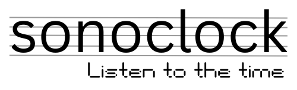

# sonoclock - Listen to the time

Sonoclock is a clock that "plays" the time as musical intervals. Designed to be accessible to blind and visually impaired users, Sonoclock is a great ear-training tool.

## How it Works

### Hour

The hour is played as one or two simultaneous notes notes with an interval corresponding to the current hour. The first note is always the root of the scale. The second note (if any) indicates the hour by its distance from the first note as follows.

* `1:00` Single root note.
* `2:00` Root note and second degree of scale
* `3:00` Root note and major/minor third degree of scale
* `4:00` Root note and perfect fourth of the scale
* `5:00` Root note and perfect fifth of the scale
* `6:00` Root note and major/minor sixth of the scale
* `7:00` Root note and major/minor seventh of the scale
* `8:00` Root note and octave tone above it (also the root of the scale)
* `9:00` Root and ninth above it (a.k.a octave plus the second degree of the scale)
* `10:00` Root and major/minor tenth above it (a.k.a octave plus a major/minor third degree of the scale)
* `11:00` Root and eleventh above it (a.k.a octave plus the perfect fourth of the scale)
* `12:00` Root and twelfth above it (a.k.a octave plus the perfect fifth of the scale)

### Minute

The minute is played as two alternating notes representing the "tens" and "ones" of the current minute. Each of these notes plays for half a second, with the "tens" note sustaining for the entire half second and the "ones" note playing for a shorter duration.  Both of these notes are in the same scale as the hour.

#### Tens

* `0:0x` (Zero) - Silence, no note  is played
* `0:1x` (Ten) - Root note of the scale
* `0:2x` (Twenties) - Second degree of the scale
* `0:3x` (Thirties) - Major/minor third of the scale
* `0:4x` (Forties) - Perfect fourth of the scale
* `0:5x` (Fifties) - Perfect fifth of the scale

#### Ones

* `0:x0` (Zero) - Silence, no note is played
* `0:x1` (One) - Root note of the scale
* `0:x2` (Two) - Second degree of the scale
* `0:x3` (Three) - Major/minor third of the scale
* `0:x4` (Four) - Perfect fourth of the scale
* `0:x5` (Five) - Perfect fifth of the scale
* `0:x6` (Six) - Major/minor sixth of the scale
* `0:x7` (Seven) - Major/minor seventh of the scale
* `0:x8` (Eight) - Root note an octave above the "tens" note
* `0:x9` (Nine) - Second degree of the scale a ninth above the root note